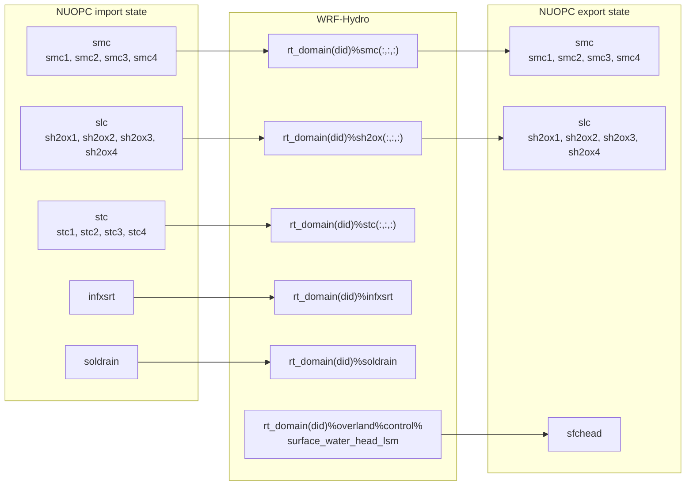
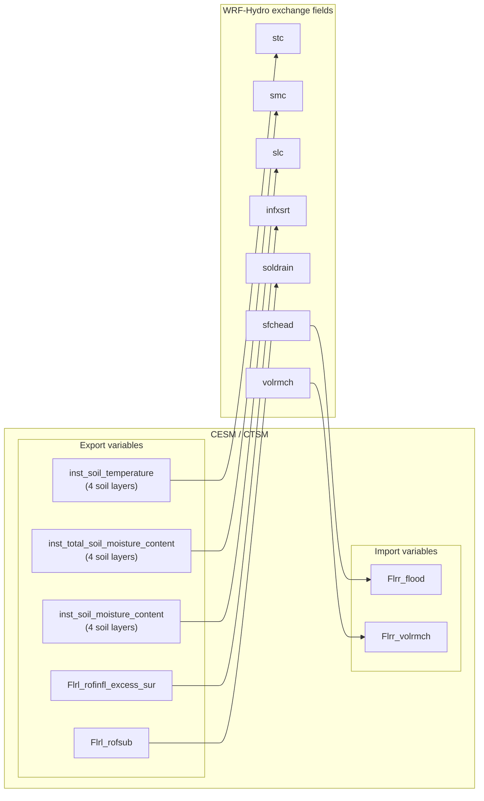

# WRF-Hydro CTSM Coupling
MPAS-Hydro CTSM Coupling is a coupling of [WRF-Hydro](https://github.com/NCAR/wrf_hydro_nwm_public) and [CTSM](https://github.com/ESCOMP/CTSM)
The coupling mechanism uses [Earth System Modeling Framework](https://earthsystemmodeling.org/)
(ESMF) and the [National Unified Operational Prediction Capability](https://earthsystemmodeling.org/nuopc)
(NUOPC) interoperability layer, also reffered to as a cap.

## Prerequisites
### Load Derecho Modules
Load appropriate set of modules, the following is for building with GNU on Derecho.
```bash
$ ml use modules
$ ml purge
$ ml gnu-cesm
```

### Obtain Source
Note, do not do `--recursive` when initiliazing the CTSM submodule.
CTSM uses git-fleximod to handle its submodules and initializing
  recursively with `git` will cause problems.

```bash
$ git clone git@github.com:NCAR/wrf-hydro_cesm.git
$ cd wrf-hydro_cesm
$ git submodule update --init
$ cd src/ctsm
$ ./bin/git-fleximod update
```

### Updating CESM Source
It is good to check the status before updating CESM
```bash
from the top wrf-hydro_cesm directory
$ git pull
$ cd src/ctsm
$ ./bin/git-fleximod status
$ ./bin/git-fleximod update
```

## Setup, Build, Run
### Quick Start
The `Quick Start` instructions shows how the `Makefile` is used condense the
  steps for setup, building, and running.
```bash
Load modules, then
$ make setup
$ make preview
$ make build
  Build won't work from Makefile, copy and paste this command
  cd path/to/build ; ./case.build --verbose
$ make run
```

### First run to create geo_em.d01.nc
The first run needs WRF-Hydro to run with 1 process, then it will need to be restarted.
This will be changed in the future so no restart is needed and any number of processes can be used.

```bash
  cd /glade/derecho/scratch/soren/cases/hydro-test
  ./xmlchange NTASKS_ROF=1
  ./case.setup --reset
  ./xmlquery NTASKS_ROF
  ./case.submit

  The full job can still use eight PETs; only WRF-Hydro runs on PET0. After run/DOMAIN/geo_em.d01.nc exists, restore it with:

  ./xmlchange NTASKS_ROF=8
  ./case.setup --reset
```

### Setup
```bash
$ export dir=/glade/derecho/scratch/$USER/cases/hydro-test
$ cd cime/scripts/ && \
$ ./create_newcase \
   --case ${dir} \
   --mach derecho \
   --compiler gnu \
   --compset I2000Ctsm50NwpSpNldasWRFHydro \
   --res nldas2_rnldas2_mnldas2 \
   --run-unsupported \
   --project NWCA0002 \
   --pesfile src/ctsm/ctsm_repo/components/wrfhydro/src/CPL/CESM_cpl/cime_config/config_pes.xml
$ cd ${dir} && \
   ./xmlchange STOP_OPTION=nhours,STOP_N=1,ROF_NCPL=24 && \
   ./case.setup
```

### Build
```bash
$ dir=$SCRATCH/cases/hydro-test
$ cd $(dir)
$ ./case.build --verbose

# preview testcase
$ ./preview_namelists
$ ./preview_run
```

### Run
```bash
$ dir=$SCRATCH/cases/hydro-test
$ ./case.submit
or run interactively
$ ./case.submit --no-batch
```


# WRF-Hydro Import and Export Fields
## New CESM and WRF-Hydro Coupling
### WRF-Hydro Import Fields
WRF-Hydro grid variables are components of the `rt_domain(did)` derived type.
See [CESM variables](doc/cesm_variables.md) for a full list of the CTSM NUOPC variables.

| CESM Field      | CESM Description    | WRF-Hydro Grid | WRF-Hydro Description       |
|-----------------|---------------------|----------------|-----------------------------|
| *Flrl_rofsur*?  | Subsurface runoff   | *infxsrt*      | infiltration excess water   |
| *Flrl_rofsub*?  | Surface runoff      | *soldrain*     | soil drainage               |
| *Sl_t*?         | Land temperature    | *stc*          | soil temperature            |
| *Sl_soilw*?     | Soil water          | *smc*          | total liq+ice soil moisture |
| *Sl_soilw*?     |                     | *sh2ox*        | liquid soil moisture        |
| *Flrl_rofgwl*   | Groundwater runoff  |                |                             |
| *Sl_fv*         | Vegetation fraction |                |                             |
| *Flrr_flood*    | Flood runoff flux   |                |                             |
| *Flrr_volr*     | River volume flux   |                |                             |
| *Flrr_volrmch*  | Main channel flow   |                |                             |
| *Sr_tdepth*     | River depth         |                |                             |
| *Sr_tdepth_max* | Max river depth     |                |                             |


### WRF-Hydro Export Fields
Set `clm_lev = 10`.

| Hydro Grid            | CESM Field |
|-----------------------|------------|
| rt\_domain(did)%stc   | ?          |
| rt\_domain(did)%smc   | ?          |
| rt\_domain(did)%sh2ox | ?          |


## Old CLM and WRF-Hydro Coupling
## WRF-Hydro Import Fields
WRF-Hydro grid variables are components of the `rt_domain(did)` derived type.

| CLM Field   | WRF-Hydro Grid | WRF-Hydro Description       |
|-------------|----------------|-----------------------------|
| qflx\_surf  | infxsrt        | infiltration excess water   |
| qflx\_drain | soldrain       | soil drainage               |
| t\_soisno   | stc            | soil temperature            |
| h2osoi\_vol | smc            | total liq+ice soil moisture |
| h2osoi\_liq | sh2ox / 1000   | liquid soil moisture        |

### WRF-Hydro Export Fields
Set `clm_lev = 10`.

| Hydro Grid                   | CLM Field   |
|------------------------------|-------------|
| rt\_domain(did)%stc          | t\_soisno   |
| rt\_domain(did)%smc          | h2osoi\_vol |
| rt\_domain(did)%sh2ox * 1000 | h2osoi\_liq |


# Miscellaneous
## Directory Structure
```text
README.md
Makefile
src/
└── ctsm/
    └── components/
        └── wrfhydro/
            └── src/CPL/CESM_cpl/
```

## Definitions

| Acronym   | Description                                                         |
|-----------|---------------------------------------------------------------------|
| **CIME**  | **Common Infrastructure for Modeling the Earth**                    |
|           | The project describes it as the infrastructure layer that provides  |
|           | a Case Control System for configuring, compiling, and running Earth |
|           | system models, along with a framework for system testing            |
| **CMEPS** | **Community Mediator for Earth Prediction Systems**                 |
|           | Coupler / mediator, CMEPS is the NUOPC driver                       |
| **LILAC** | **Lightweight Infrastructure for Land-Atmosphere Coupling**         |
|           | lightweight coupling layer built on top of ESMF so atmosphere       |
|           | models can call CTSM directly and a set of Python-based tools for   |
|           | building CTSM and creating its runtime inputs in that coupling mode |

# Import/Export Variables

## WRF-Hydro


## CESM


